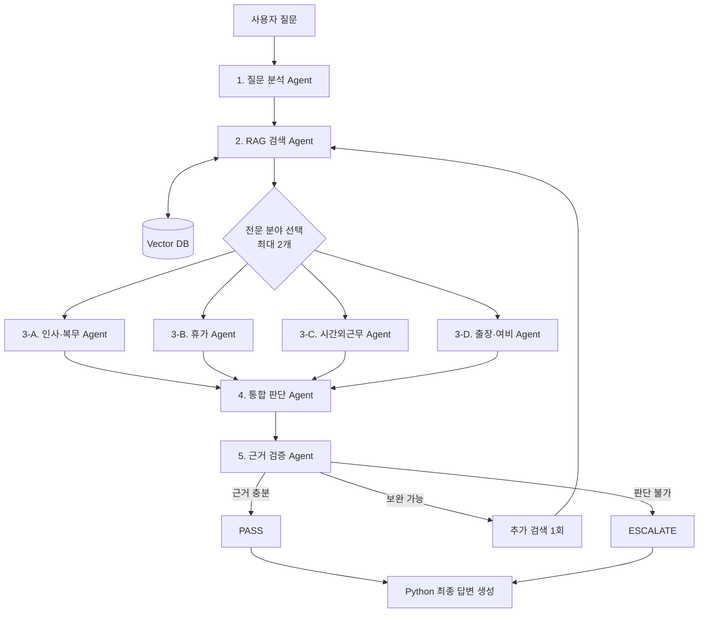

# 사내 규정 RAG 멀티에이전트 시스템

사내 규정 HWP/HWPX 원본에서 관련 조항을 검색하고, CrewAI 멀티에이전트가 분야별 검토,
통합 판단, 근거 검증을 수행하는 Python 프로젝트입니다.

이 프로젝트의 핵심은 두 가지입니다.

1. **RAG**: 전체 원본을 매번 읽지 않고 Vector DB에서 관련 조항만 검색합니다.
2. **Multi-Agent**: 검색된 조항을 전문 Agent가 검토하고 별도 Agent가
   판단과 근거를 다시 검증합니다.

> 기본 데이터는 상위 `rule/` 폴더의 실제 사내 규정 HWP/HWPX 5개입니다.

## 한눈에 보는 구조



실행 흐름:

```text
사내 규정 HWP/HWPX
  → 조항 단위 파싱
  → 로컬 임베딩과 Chroma Vector DB
  → 관련 조항 검색
  → 전문 Agent 최대 2개 검토
  → 통합 판단
  → 근거 검증
  → Python 최종 답변
```

최종 답변은 별도의 LLM Agent가 작성하지 않습니다. 검증된 Pydantic 객체와
실제 규정 근거를 Python 함수가 정해진 Markdown 형식으로 출력합니다.

## 현재 규정 데이터

2026-07-23 기준 실제 `rule/` corpus 상태:

| 규정 | Vector DB chunk |
|---|---:|
| 취업규칙 | 35 |
| 복무규정 | 76 |
| 병가 등 휴가 운영방법 | 8 |
| 시간외근무 실시기준 | 11 |
| 여비규정 | 31 |
| **합계** | **161** |

원본 HWP/HWPX와 Vector DB는 실행 시 증분 동기화됩니다. 변경이 없는 파일은
재파싱·재임베딩하지 않고 기존 chunk를 재사용합니다.

`vector_db/`에는 검색 벡터와 원문 chunk가 들어 있지만 원본을 대체하지
않습니다. 실제 규정의 기준은 `rule/` 원본이므로 계속 보관해야 합니다.

## Agent 구성

CrewAI 모드에서는 총 8개 Agent 객체를 구성합니다.

| Agent | 역할 | 실행 조건 |
|---|---|---|
| 질문 분석 | 조건, 검색어 3개, 전문 분야 선택 | 항상 |
| RAG 검색 | Vector DB에서 실제 규정 근거 수집 | 항상 |
| 인사·복무 전문 | 취업규칙·복무규정 검토 | 선택 시 |
| 휴가 전문 | 병가·휴가 규정 검토 | 선택 시 |
| 시간외근무 전문 | 연장·야간·휴일근무 검토 | 선택 시 |
| 출장·여비 전문 | 출장·교통·숙박·정산 검토 | 선택 시 |
| 통합 판단 | 근거와 전문 의견을 통합 | 항상 |
| 근거 검증 | 주장과 원문 근거를 대조 | 항상 |

질문마다 전문 Agent는 최대 2개만 병렬 실행합니다. 근거가 부족하면 검색부터
검증까지 최대 한 번만 다시 수행합니다.

## 빠른 실행

### 설치

Python 3.11 환경을 권장합니다.

```bash
python3.11 -m venv .venv
source .venv/bin/activate
python -m pip install -e ".[notebook]"
```

### Vector DB 생성·동기화

질문하지 않고 규정 문서를 Vector DB에 반영한 뒤 종료합니다. 기본 동작은
변경된 문서만 처리하는 증분 동기화입니다.

```bash
policy-rag --index-only
```

### CrewAI + OpenAI 질문

`.env`에 API 키와 외부 전송 승인을 설정한 뒤 실행합니다.

```dotenv
OPENAI_API_KEY=...
OPENAI_MODEL_NAME=openai/gpt-4o-mini
ALLOW_EXTERNAL_LLM_POLICY_DATA=true
```

```bash
policy-rag \
  "국내 출장 숙박비와 교통비는 어떻게 정산하나요?"
```

질문 실행은 항상 CrewAI와 OpenAI를 사용합니다. 검색된 규정 원문 일부가
OpenAI API로 전송되고 API 사용량이 발생하므로 조직의 데이터 처리 정책을
확인한 경우에만 실행해야 합니다.

## 처리 상태

| 상태 | 의미 |
|---|---|
| `PASS` | 근거와 판단 연결이 충분함 |
| `RETRY 후 PASS` | 추가 검색 한 번으로 근거를 확보함 |
| `ESCALATE` | 근거 부족, 충돌 또는 규정 밖 질문으로 담당 부서 확인 필요 |

검색 근거가 없으면 모델의 일반 지식으로 답을 보충하지 않습니다.

## 프로젝트 구조

```text
internal_policy_rag_crewai/
├── README.md
├── docs/                         # 상세 기술·운영 문서
├── src/internal_policy_rag/      # RAG와 Agent 구현
├── tests/                        # 자동화 테스트
├── vector_db/                    # Chroma DB, Git 제외
└── practice_2_internal_policy_rag_multi_agent.ipynb
```

## 상세 문서

- [아키텍처와 Agent 구조](docs/architecture.md)
- [설치와 실행](docs/getting-started.md)
- [테스트와 운영](docs/testing-and-operations.md)
- [발표 개요](docs/presentation_outline.md)
- [문서 목록](docs/README.md)

## 안전 원칙

- 접근등급과 현행 문서 필터는 Python 코드가 강제합니다.
- 모든 주요 판단은 실제 `evidence_id`와 연결합니다.
- LLM이 반환한 근거를 Chroma 원문과 다시 대조합니다.
- 폐지·구버전 문서와 충돌하는 규정은 자동으로 선택하지 않습니다.
- 재검색은 최대 1회로 제한합니다.
- 근거가 부족하면 `ESCALATE`로 종료합니다.

자세한 신뢰 경계, 보안 체크리스트, 확장 방법과 제한사항은
[테스트와 운영 문서](docs/testing-and-operations.md)를 참고하세요.
