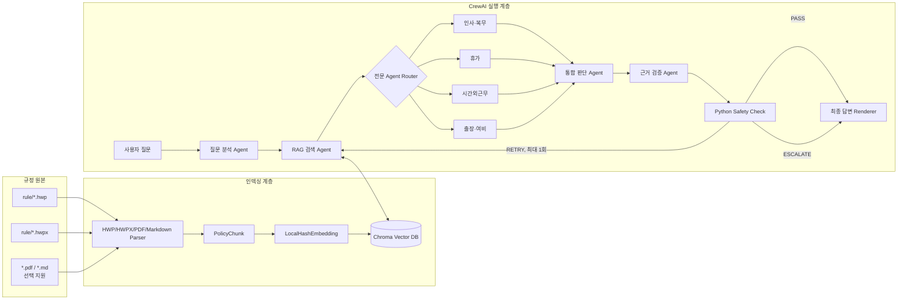
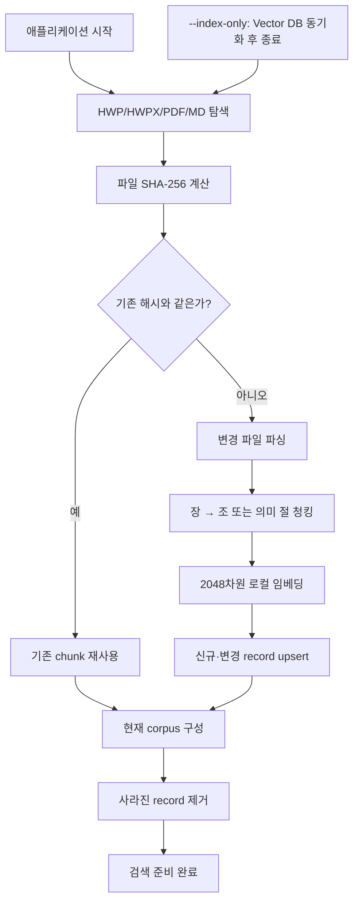
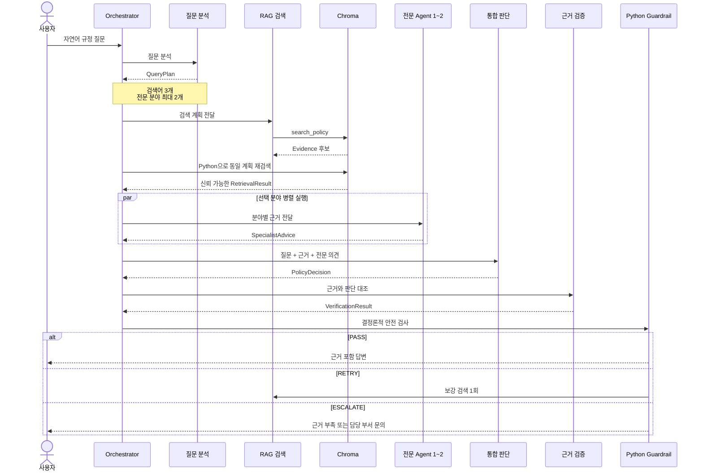
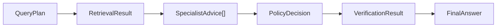

# 아키텍처와 Agent 구조

이 문서는 사내 규정 HWP/HWPX 원본이 Vector DB에 저장되고, CrewAI 멀티에이전트가
근거를 검색·판단·검증하는 전체 구조를 설명합니다.

## 전체 아키텍처



구조는 세 계층으로 나뉩니다.

1. 인덱싱 계층: 원본을 파싱·청킹·임베딩해 Vector DB에 저장합니다.
2. 검색·판단 계층: 질문에 관련된 규정을 찾고 전문 Agent가 검토합니다.
3. 신뢰 계층: Agent 출력과 근거 ID를 Python 코드가 다시 검사합니다.

## 규정 인덱싱



### 문서 파싱

- HWP 5.x는 로컬 `pyhwp`의 `hwp5txt`로 텍스트를 추출합니다.
- HWPX는 ZIP 내부 `Contents/section*.xml`을 문서 순서대로 읽습니다.
- PDF는 `pdfplumber`로 텍스트를 추출합니다.
- Markdown은 YAML front matter와 제목 구조를 읽습니다.
- 기본 단위는 `문서 → 장 → 제N조`입니다.
- 병가 운영방법처럼 조 번호가 없는 문서는 의미 절로 나눕니다.
- 항·호·단서·예외는 다음 조가 시작되기 전까지 같은 chunk에 유지합니다.
- 빈 제목, 삭제 조항, 문자 깨짐 비율이 높은 chunk는 제외합니다.

현재 기본 corpus는 상위 `rule/`의 실제 HWP/HWPX 5개이며 161개 chunk로
인덱싱되어 있습니다. HWP/HWPX 추출은 로컬에서만 수행합니다.

### 임베딩

기본 `LocalHashEmbedding`은 외부 임베딩 API를 사용하지 않습니다.

- 한국어·영문·숫자 단어
- 인접 단어 bigram
- 문자 2-gram과 3-gram
- BLAKE2 기반 고정 인덱스
- 2048차원 L2 정규화
- Chroma cosine similarity

작은 교육용 corpus를 네트워크 없이 재현하기 위한 구현입니다. 의미적 동의어
검색이 중요한 운영 환경에서는 승인된 다국어 임베딩 모델이나 하이브리드
검색으로 교체해야 합니다.

### Chroma 저장 구조

```text
internal_policy_rag_crewai/
└── vector_db/
    ├── chroma.sqlite3
    └── <vector segment directories>

collection: internal_policies
```

한 규정마다 DB를 만들지 않고 공용 collection을 사용합니다. 원본 정책
폴더별 `corpus_id`와 분야별 `document_type`으로 검색 범위를 분리합니다.

주요 metadata:

| 필드 | 설명 |
|---|---|
| `corpus_id` | 원본 정책 폴더 경로의 해시 |
| `chunk_id` | 문서·버전·장·조·내용 기반 ID |
| `document_name`, `document_type` | 규정명과 전문 분야 |
| `chapter`, `article` | 장과 조항 |
| `version`, `effective_date` | 버전과 시행일 |
| `status` | `active`, `outdated`, `repealed` |
| `access_level` | `ALL`, `INTERNAL`, `CONFIDENTIAL` |
| `source_file`, `source_hash` | 원본 파일과 SHA-256 |
| `record_hash` | chunk와 임베딩 설정을 포함한 해시 |
| `embedding_id` | 임베딩 구현 식별자 |

Vector DB에는 검색 벡터뿐 아니라 원문 chunk도 저장됩니다. 그러나 DB는 원본을
대체하지 않습니다. 시작할 때 원본 폴더와 증분 동기화하므로 `rule/` 원본을
계속 보관해야 합니다.

## 질문 처리 흐름



Retrieval Agent가 반환한 원문을 그대로 신뢰하지 않습니다. LLM이
`evidence_id`, 버전, 조항을 실수로 변경할 수 있기 때문에 Python이 동일한
검색 계획으로 Chroma를 다시 조회하고 그 결과만 다음 단계에 전달합니다.

## Agent 구성

CrewAI 모드에는 총 8개 Agent 객체가 있습니다.

| Agent | 주요 입력 | 출력 | 실행 조건 |
|---|---|---|---|
| 질문 분석 및 검색 설계 | 사용자 질문 | `QueryPlan` | 항상 |
| RAG 규정 검색 | `QueryPlan` | `RetrievalResult` | 항상 |
| 인사·복무 전문 | 분야별 근거 | `SpecialistAdvice` | 선택 시 |
| 휴가 전문 | 분야별 근거 | `SpecialistAdvice` | 선택 시 |
| 시간외근무 전문 | 분야별 근거 | `SpecialistAdvice` | 선택 시 |
| 출장·여비 전문 | 분야별 근거 | `SpecialistAdvice` | 선택 시 |
| 통합 규정 적용 및 판단 | 질문, 근거, 전문 의견 | `PolicyDecision` | 항상 |
| 근거 검증 | 근거, 판단 | `VerificationResult` | 항상 |

일반 질문은 보통 5~6개 Agent 단계를 거칩니다. 질문 분석 결과에 따라 전문
Agent는 최대 2개만 병렬 실행합니다. `RETRY`가 발생하면 검색·전문 검토·통합
판단·검증을 한 번 더 실행할 수 있습니다.

### 전문 Agent 라우팅

| 전문 분야 | 주요 검토 문서 | 책임 |
|---|---|---|
| 인사·복무 | 취업규칙, 복무규정 | 근무 의무, 겸직, 징계, 공통 원칙 |
| 휴가 | 병가 운영방법, 복무규정, 취업규칙 | 대상, 일수, 증빙, 승인, 예외 |
| 시간외근무 | 시간외근무 실시기준, 복무규정 | 사전 허가, 시간 계산, 한도, 보상 |
| 출장·여비 | 여비규정, 복무규정 | 출장 승인, 교통·숙박·식비, 정산 |

## Agent 데이터 계약

Agent 사이에는 자유 형식 문자열이 아니라 Pydantic 객체를 전달합니다.



모든 모델은 알 수 없는 필드를 거부합니다. OpenAI strict structured output과
호환되도록 object를 닫힌 schema로 정의하며, 자동화 테스트가
`additionalProperties=false`와 필수 필드를 확인합니다.

## Python 안전 검사

검증 Agent가 `PASS`를 반환해도 Python이 다음 조건을 다시 확인합니다.

- 주요 판단에 적용 규정이 존재하는가
- 모든 `evidence_id`가 실제 검색 결과에 존재하는가
- 참조된 근거가 모두 `active`인가
- 충돌 규정이 없는가
- 재검색이 최대 1회인가
- 사용자 접근등급을 넘는 근거가 없는가

조건을 만족하지 않으면 `PASS`를 그대로 사용하지 않고 `ESCALATE`로
변경합니다. 최종 Markdown도 별도 LLM이 아니라 Python 함수가 렌더링합니다.

## 처리 상태

| 상태 | 의미 | 동작 |
|---|---|---|
| `PASS` | 근거와 판단 연결이 충분함 | 최종 답변 생성 |
| `RETRY` | 보강 검색으로 해결 가능 | 최대 1회 재검색 |
| `RETRY 후 PASS` | 재검색 후 근거 확보 | 재검색 사실과 함께 답변 |
| `ESCALATE` | 근거 부족, 충돌, 규정 밖 질문 | 담당 부서 확인 안내 |

두 번째 검증에서도 `RETRY`이면 자동으로 `ESCALATE`가 됩니다.

## 파일별 호출 관계

```text
cli.py
  └── orchestrator.py
      ├── rag.py
      │   ├── vector_store.py
      │   └── parser.py
      ├── agents.py
      │   ├── prompts.py
      │   ├── routing.py
      │   └── rag.py
      ├── offline.py  # 자동화 테스트 전용 Runtime
      └── models.py
```
