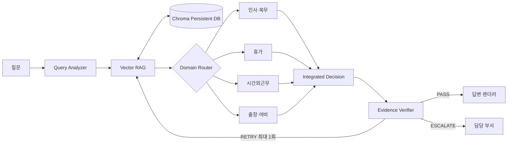

# 사내 규정 RAG 멀티에이전트 발표 개요

## 1. 문제 정의 및 Biz 가치

### 문제

- 사내 규정은 문서와 버전이 분산되어 검색 비용이 높다.
- 질문의 맥락, 적용 대상, 예외, 승인 절차를 동시에 확인해야 한다.
- 일반 LLM 답변은 존재하지 않는 조항이나 숫자를 만들 위험이 있다.
- 구버전과 권한 밖 문서가 섞이면 정확성 문제가 보안 사고로 이어진다.

### 가치

- 질문에서 답변까지의 탐색 시간을 단축한다.
- 답변마다 문서명, 조항, 시행일을 표시해 감사 가능성을 높인다.
- 근거 부족을 `ESCALATE`로 명시해 잘못된 자동 결정을 줄인다.
- 인사·재무·보안 담당 부서의 반복 문의를 구조화한다.

발표 화면: 문제 상황, 기존 수작업 흐름, 기대 KPI(검색 시간, 근거 포함률,
담당 부서 재문의율)를 한 장에 배치한다.

## 2. 멀티에이전트 및 RAG 아키텍처

- Query Analyzer: 분야, 조건, 누락 정보, 서로 다른 검색어 3개
- Retrieval Agent: custom tool로 현행 원문과 metadata 검색
- Domain Router: 질문마다 관련 전문 Agent를 최대 2개만 선택
- 4개 전문 Agent: 인사·복무, 휴가, 시간외근무, 출장·여비 교차 검토
- Integrated Decision Agent: 전문 의견을 통합하고 주장별 `evidence_id` 연결
- Verification Agent: `SUPPORTED` 등 주장별 상태와 최종 상태 결정
- Python guardrail: 권한, 버전, 재시도 상한, 최종 근거 참조 무결성 강제

강조점: LLM은 해석에 쓰고 보안 정책과 반복 제어는 결정론적 코드에 둔다.

## 3. Transformer, Tokenization, Embedding, ReAct, Self-Consistency

### Transformer와 Tokenization

- LLM은 토큰 단위로 질문과 제한된 컨텍스트를 처리한다.
- 전체 규정집 대신 관련 조항만 전달해 컨텍스트 노이즈와 비용을 줄인다.
- 숨겨진 사고 과정을 요구하지 않고 검증 가능한 필드만 구조화 출력한다.

### Embedding과 Vector Search

- 문서를 고정 글자 수가 아닌 `장 → 조 → 항·호·단서` 의미 단위로 청킹한다.
- 기본 데모는 단어/문자 n-gram 해시 임베딩과 코사인 유사도를 사용한다.
- Chroma 공용 collection에 문서 해시와 버전 metadata를 영속 저장한다.
- 변경되지 않은 문서는 재파싱·재임베딩하지 않고 변경분만 upsert한다.
- 여러 검색어 결과를 합치고 같은 `evidence_id`를 제거한다.
- `corpus_id`, `status=active`, 접근 등급을 유사도 검색 전에 필터링한다.

### ReAct

질문 분석 → 검색 도구 호출 → 근거 관찰 → 적용 판단 → 검증 → 필요 시 재검색.

### Self-Consistency

- LLM 다수결 대신 서로 다른 관점의 검색어 3개를 사용한다.
- 여러 검색 결과가 같은 조항으로 수렴하는지 확인한다.
- 비용을 크게 늘리지 않으면서 검색 누락 위험을 낮춘다.

## 4. 실행 결과

시연 순서:

1. 병가 4일 연속 사용: 진단서·증빙 조건과 휴가 Agent 선택
2. 시간외근무: 실시기준과 복무규정 전문 Agent 2개 교차 검토
3. 국내 출장: 여비규정의 지급·정산 조항 표시
4. 영리 목적 부업: 취업규칙과 복무규정의 겸직 조항 교차 검토
5. 규정에 없는 질문: 일반 상식을 만들지 않고 `ESCALATE`

표에 질문, 상태, 결론, 근거 수, 재검색 여부, 신뢰도, 실행 시간을 표시한다.

## 5. 단일 Agent와 비교

| 비교 항목 | Single Agent | Multi-Agent RAG |
|---|---|---|
| 근거 조항 | 모델 기억에 의존 | 실제 검색 근거에 강제 연결 |
| 출처 정확성 | 검증 단계 없음 | 현행 chunk ID와 대조 |
| 예외 조건 | 누락 가능 | 판단/검증 단계에서 별도 점검 |
| 근거 없는 주장 | 탐지 어려움 | Verifier와 Python guardrail |
| LLM 호출 수 | 1 | 기본 5~6, 재검색 시 최대 9~11 |
| 비용/시간 | 낮음 | 높지만 감사 가능성 향상 |

노트북에서 같은 질문 2~3개를 실제 API로 실행한다. API가 토큰 사용량을
제공하지 않으면 호출 횟수와 시간만 보고하고 숫자를 추정하지 않는다.

## 6. 한계 및 발전 방향

### 현재 한계

- 교육용 가상 문서와 작은 corpus
- 경량 로컬 임베딩의 동의어·장문 검색 성능
- 모델 기반 해석과 검증이 완전히 독립적이지 않을 수 있음
- 부서 권한이 데모 context 값에 머물며 실제 IAM과 연결되지 않음

### 발전 방향

- 사내 승인 임베딩과 하이브리드 검색/BM25, reranker
- SSO, 문서 DMS, RBAC/ABAC, KMS와 연동
- DMS 문서 변경 이벤트와 현재 해시 기반 증분 재색인의 연동
- claim-evidence entailment 전용 평가 모델과 사람 승인
- 검색 recall, citation precision, unsupported claim rate 대시보드
- 고위험 질문의 자동 `ESCALATE` 정책과 담당 부서 티켓 연동
