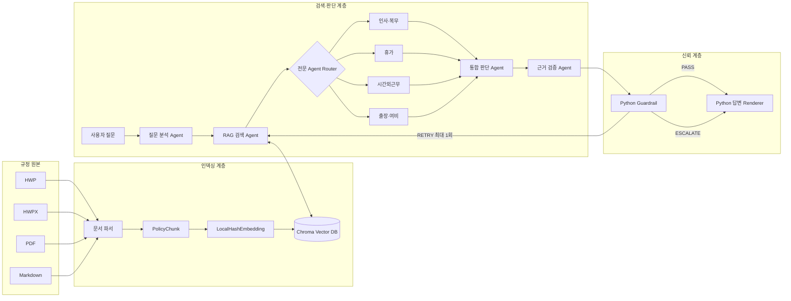
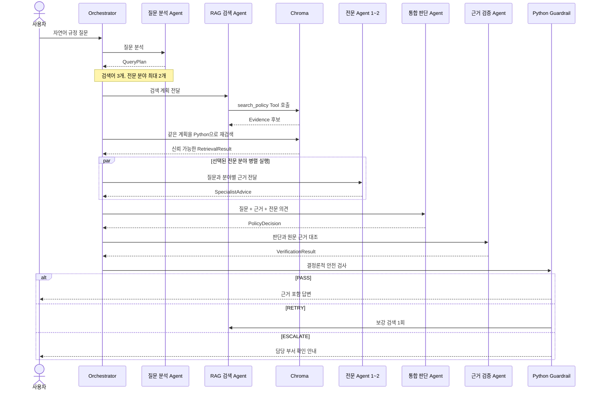
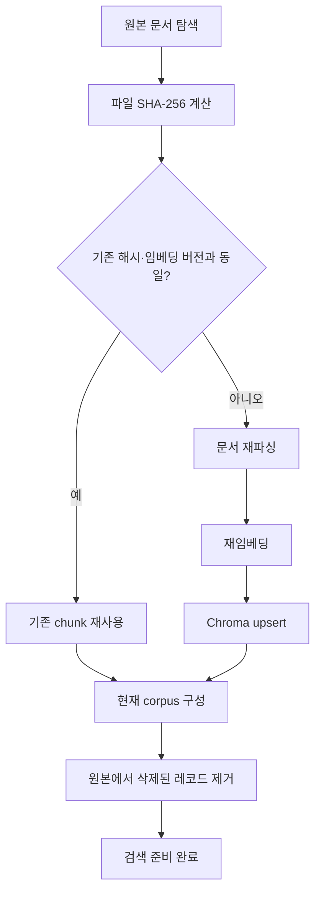

# Internal Policy Multi-Agent RAG System

> **근거 없으면 침묵한다.**  
> 사내 규정 원문을 검색하고, 분야별 CrewAI Agent가 판단과 근거를 교차 검증하는
> Multi-Agent 기반 RAG 시스템입니다.

## 1. 프로젝트 개요

사내 규정은 문서가 여러 파일로 나뉘어 있고, 질문 하나에도 적용 대상, 예외,
승인 절차, 문서 버전을 함께 확인해야 합니다. 일반적인 LLM 질의응답은
존재하지 않는 조항이나 숫자를 생성하거나, 구버전 문서를 근거로 답할 위험이
있습니다.

이 프로젝트는 다음 원칙으로 문제를 해결합니다.

- 전체 규정집을 LLM에 전달하지 않고 관련 조항만 RAG로 검색합니다.
- 질문 분야에 맞는 전문 Agent를 최대 2개 선택해 병렬 검토합니다.
- 모든 주요 판단을 실제 `evidence_id`와 연결합니다.
- 별도의 검증 Agent와 Python guardrail이 근거를 다시 검사합니다.
- 근거가 부족하면 일반 지식으로 채우지 않고 `RETRY` 또는 `ESCALATE`합니다.
- 최종 답변은 LLM이 자유롭게 다시 작성하지 않고 Python이 정해진 형식으로
  렌더링합니다.

이 시스템은 사내 규정 검색과 답변 생성을 지원하는 **교육·데모용
프로토타입**이며, 법률·노무 자문이나 최종 인사 결정을 대신하지 않습니다.

---

## 2. 핵심 특징

### 조항 단위 RAG

- HWP, HWPX, PDF, Markdown 형식 지원
- `장 → 조 → 항·호·단서` 구조를 가능한 한 유지한 의미 단위 청킹
- 조 번호가 없는 운영 지침은 의미 절 단위로 분리
- 2048차원 로컬 해시 임베딩
- Chroma Persistent Vector DB 사용
- 여러 검색어 결과의 `evidence_id` 중복 제거
- 현행 상태와 접근등급을 검색 단계에서 필터링

### CrewAI Multi-Agent

- 질문 분석 Agent
- RAG 검색 Agent
- 인사·복무 전문 Agent
- 휴가 전문 Agent
- 시간외근무 전문 Agent
- 출장·여비 전문 Agent
- 통합 판단 Agent
- 근거 검증 Agent

CrewAI는 모델 자체가 아니라 Agent, Task, Tool, Crew 실행을 구성하는
오케스트레이션 프레임워크입니다. 실제 LLM은 기본 설정 기준 OpenAI
`gpt-4o-mini`를 사용합니다.

### 근거 중심 신뢰 구조

- Agent 사이의 데이터를 Pydantic 객체로 검증
- LLM이 반환한 검색 원문과 metadata를 신뢰하지 않고 Python에서 재검색
- 존재하지 않는 `evidence_id` 차단
- 구버전·폐지 문서 근거 차단
- 충돌 규정 자동 선택 금지
- 재검색 최대 1회
- 근거 부족 시 담당 부서 확인으로 전환

---

## 3. 전체 아키텍처



시스템은 세 계층으로 구분됩니다.

1. **인덱싱 계층**: 규정 원본을 파싱·청킹·임베딩하여 Chroma에 저장합니다.
2. **검색·판단 계층**: 질문을 분석하고 관련 근거와 전문 의견을 수집합니다.
3. **신뢰 계층**: LLM의 판단과 근거 연결을 결정론적 Python 코드로 검사합니다.

---

## 4. 질문 처리 흐름



### 단계별 설명

1. **질문 분석**
   - 규정 분야와 질문 의도를 분류합니다.
   - 질문에 명시된 조건과 누락 정보를 구분합니다.
   - 서로 다른 관점의 검색어를 정확히 3개 생성합니다.
   - 전문 분야를 최대 2개 선택합니다.

2. **RAG 검색**
   - Retrieval Agent가 `search_policy` Tool을 호출합니다.
   - Python이 동일한 `QueryPlan`으로 Chroma를 다시 조회합니다.
   - Agent가 원문, 버전, 조항 또는 ID를 바꿔 쓰는 문제를 차단합니다.

3. **전문 검토**
   - 선택된 전문 Agent가 최대 2개까지 병렬 실행됩니다.
   - 각 Agent는 자신의 분야 근거만 검토합니다.

4. **통합 판단**
   - 검색 근거와 전문 의견을 통합합니다.
   - 일반 원칙, 예외, 불확실성을 분리합니다.
   - 주요 주장마다 실제 `evidence_id`를 연결합니다.

5. **근거 검증**
   - 주장과 원문이 실제로 일치하는지 확인합니다.
   - 근거 누락, 충돌, 구버전, 근거 밖 주장을 검사합니다.

6. **Python 안전 검사 및 출력**
   - 검증 Agent가 `PASS`를 반환해도 Python이 다시 검사합니다.
   - 최종 결과는 Python이 Markdown 또는 JSON으로 출력합니다.

---

## 5. Agent 구성

| Agent | 역할 | 입력 | 출력 | 실행 조건 |
|---|---|---|---|---|
| 질문 분석 및 검색 설계 | 질문을 규정 용어와 검색 관점으로 변환 | 사용자 질문 | `QueryPlan` | 항상 |
| RAG 규정 검색 | Tool로 현행 규정 근거 수집 | `QueryPlan` | `RetrievalResult` | 항상 |
| 인사·복무 전문 | 취업규칙·복무규정 검토 | 분야별 근거 | `SpecialistAdvice` | 선택 시 |
| 휴가 전문 | 병가·연차·휴가의 조건·증빙·예외 검토 | 분야별 근거 | `SpecialistAdvice` | 선택 시 |
| 시간외근무 전문 | 허가·시간 계산·한도·보상 검토 | 분야별 근거 | `SpecialistAdvice` | 선택 시 |
| 출장·여비 전문 | 출장 승인·교통·숙박·식비·정산 검토 | 분야별 근거 | `SpecialistAdvice` | 선택 시 |
| 통합 규정 판단 | 근거와 전문 의견 통합 | 질문·근거·전문 의견 | `PolicyDecision` | 항상 |
| 근거 검증 | 모든 주장을 원문과 대조 | 근거·통합 판단 | `VerificationResult` | 항상 |

일반적인 질문은 5~6개의 Agent Task를 거칩니다. 각 Task는 하나의 Agent로
구성된 Crew에서 `Process.sequential`로 실행되며, 선택된 전문 Agent 작업만
`asyncio.gather()`로 병렬 처리됩니다. Agent 간 위임은 비활성화되어 있습니다.

---

## 6. Agent 데이터 계약

Agent 사이에 자유 형식 문자열을 그대로 전달하지 않습니다.
`models.py`의 Pydantic 모델로 각 단계의 입력과 출력을 검증합니다.


| 모델 | 주요 내용 |
|---|---|
| `QueryPlan` | 분야, 의도, 조건, 누락 정보, 검색어 3개, 필요 문서, 전문 분야 |
| `PolicyChunk` | 문서명, 장·조, 시행일, 버전, 상태, 접근등급, 원문 |
| `Evidence` | 검색 근거와 점수, 매칭된 검색어, `evidence_id` |
| `RetrievalResult` | 중복 제거된 근거와 검색 실패 쿼리 |
| `SpecialistAdvice` | 분야별 사실, 규정 발견, 예외, 불확실성, 권고 |
| `PolicyDecision` | 확인 사실, 적용 규정, 예외, 결론, 신뢰도 |
| `ClaimCheck` | 주장별 지원·부분지원·미지원·충돌·구버전 상태 |
| `VerificationResult` | `PASS`, `RETRY`, `ESCALATE` 및 검증 상세 |
| `FinalAnswer` | 결론, 근거, 조건, 주의사항, 처리 상태, Markdown |
| `PolicyRunResult` | 전체 실행 결과, 재시도, 호출 수, 토큰, 실행 시간, 오류 |

모든 객체는 알 수 없는 추가 필드를 거부하도록 `extra="forbid"`를 사용하며,
OpenAI strict structured output과 호환되는 닫힌 스키마를 지향합니다.

---

## 7. 처리 상태

| 상태 | 의미 | 시스템 동작 |
|---|---|---|
| `PASS` | 판단과 실제 근거의 연결이 충분함 | 근거 포함 답변 출력 |
| `RETRY` | 추가 검색으로 보완 가능함 | 새로운 검색어로 최대 1회 재검색 |
| `RETRY 후 PASS` | 재검색 후 근거를 확보함 | 재검색 사실과 함께 답변 |
| `ESCALATE` | 근거 부족, 충돌, 권한 또는 규정 밖 질문 | 담당 부서 확인 안내 |

두 번째 검증에서도 `RETRY`가 나오거나 재검색 한도가 0이면 자동으로
`ESCALATE`됩니다.

---

## 8. 규정 인덱싱과 Vector DB

### 지원 문서

| 형식 | 추출 방식 |
|---|---|
| HWP 5.x | `pyhwp`의 `hwp5txt`를 로컬 subprocess로 실행 |
| HWPX | ZIP 내부 `Contents/section*.xml`을 문서 순서대로 파싱 |
| PDF | `pdfplumber`로 텍스트 추출 |
| Markdown | YAML front matter와 제목 구조 파싱 |

### 청킹

- 기본 단위: `문서 → 장 → 제N조`
- 항·호·단서·예외는 다음 조가 시작되기 전까지 같은 chunk에 유지
- 조 번호가 없는 병가 운영방법 등은 의미 절 단위로 분리
- 삭제 조항, 빈 chunk, 문자 깨짐 비율이 높은 chunk 제외
- 문서명, 버전, 장, 조, 내용으로 안정적인 `chunk_id` 생성

### 로컬 임베딩

`LocalHashEmbedding`은 외부 임베딩 API 없이 다음 특징을 사용합니다.

- 한국어·영문·숫자 토큰
- 인접 단어 bigram
- 문자 2-gram과 3-gram
- BLAKE2 기반 고정 인덱스
- 2048차원 L2 정규화
- Chroma cosine distance 기반 검색

이는 작은 교육용 corpus를 네트워크 없이 재현하기 위한 방식입니다.
운영 환경에서는 승인된 다국어 임베딩, BM25 기반 하이브리드 검색,
reranker 적용이 필요할 수 있습니다.

### 증분 동기화



Chroma의 공용 collection 이름은 `internal_policies`입니다. 원본 폴더별
`corpus_id`를 사용해 서로 다른 corpus를 구분합니다.

주요 metadata:

- `corpus_id`, `chunk_id`
- `document_name`, `document_type`, `department`
- `chapter`, `article`
- `version`, `effective_date`, `status`
- `access_level`
- `source_file`, `source_hash`, `record_hash`
- `embedding_id`, `index_schema_version`

Vector DB에는 벡터와 원문 chunk가 함께 저장되지만 원본 문서를 대체하지
않습니다.

---

## 9. 현재 규정 corpus

`Archive/rule/`에는 다음 실제 규정 원본 5개가 포함되어 있습니다.

| 규정 | 형식 | 담당 분야 |
|---|---|---|
| 병가 등 휴가 운영방법 | HWP | 휴가 |
| 복무규정 | HWPX | 인사·복무 |
| 시간외근무 실시기준 | HWP | 시간외근무 |
| 여비규정 | HWPX | 출장·여비 |
| 취업규칙 | HWPX | 인사·복무 |

내부 기술 문서에 기록된 최근 인덱싱 결과는 총 **161개 chunk**입니다.
원본 수정이나 임베딩 버전 변경 후에는 실제 `--index-only` 출력값을 기준으로
확인해야 합니다.

원본 파일명에서 규정 종류와 제·개정일을 추론합니다. 지원하지 않는 파일명은
안전하게 metadata를 추론할 수 없으므로 명시적인 오류를 발생시킵니다.
운영 환경에서는 파일명 추론 대신 DMS 승인 metadata 또는 별도 manifest를
사용해야 합니다.

---

## 10. 프로젝트 구조

```text
Internal Policy Multi-Agent RAG System/
├── README.md                         # 프로젝트 통합 문서
├── .gitignore                        # API 키, DB, 캐시 등 Git 제외
├── Presentation ppt.pdf              # 프로젝트 발표 자료
└── Archive/
    ├── rule/                          # 실제 사내 규정 HWP/HWPX 5개
    └── internal_policy_rag_crewai/    # 실행 가능한 Python 프로젝트
        ├── README.md                  # 내부 프로젝트 요약
        ├── .env.example               # 환경변수 예시
        ├── pyproject.toml             # 패키지·CLI·의존성 설정
        ├── requirements.txt           # pip 의존성 목록
        ├── docs/
        │   ├── README.md
        │   ├── architecture.md
        │   ├── getting-started.md
        │   ├── testing-and-operations.md
        │   └── presentation_outline.md
        └── src/internal_policy_rag/
            ├── __init__.py
            ├── agents.py
            ├── cli.py
            ├── evaluation.py
            ├── hwp.py
            ├── models.py
            ├── offline.py
            ├── orchestrator.py
            ├── parser.py
            ├── prompts.py
            ├── rag.py
            ├── routing.py
            └── vector_store.py
```

> 내부 Git 이력에는 `tests/`, Jupyter Notebook, `vector_db/.gitkeep` 등이
> 기록되어 있으나 현재 상위 프로젝트의 실제 작업 트리에는 포함되어 있지
> 않습니다. 따라서 아래 테스트·노트북 설명은 원본 개발 구조를 함께 설명한
> 것이며, 현재 배포본에서 실행하려면 해당 파일을 먼저 복원해야 합니다.

---

## 11. 주요 파일별 역할

| 파일 | 역할 |
|---|---|
| `src/internal_policy_rag/cli.py` | `policy-rag` CLI 진입점, Rich 진행 UI, Markdown/JSON 출력 |
| `src/internal_policy_rag/orchestrator.py` | 분석→검색→전문 검토→판단→검증→재검색 전체 흐름 |
| `src/internal_policy_rag/agents.py` | CrewAI Agent 8개, Task/Crew 실행, 환경변수 로딩 |
| `src/internal_policy_rag/prompts.py` | 공통 안전 원칙과 단계별 Task 프롬프트 |
| `src/internal_policy_rag/models.py` | Pydantic 기반 Agent 데이터 계약 |
| `src/internal_policy_rag/rag.py` | 검색 API, 복수 검색어 병합, CrewAI 검색 Tool |
| `src/internal_policy_rag/vector_store.py` | 로컬 임베딩, Chroma 저장·검색·증분 동기화 |
| `src/internal_policy_rag/parser.py` | HWP/HWPX/PDF/Markdown 파싱과 조항 청킹 |
| `src/internal_policy_rag/hwp.py` | HWP/HWPX 로컬 텍스트 추출 |
| `src/internal_policy_rag/routing.py` | 전문 분야 선택과 분야별 근거 제한 |
| `src/internal_policy_rag/offline.py` | API 없이 상태 전이·검색을 확인하는 테스트 전용 Runtime |
| `src/internal_policy_rag/evaluation.py` | 평가 질문, 일괄 실행, Single Agent 비교 |
| `src/internal_policy_rag/__init__.py` | 외부에 공개하는 Python API |

실제 호출 관계:

```text
cli.py
└── orchestrator.py
    ├── agents.py
    │   ├── prompts.py
    │   ├── routing.py
    │   └── rag.py
    ├── rag.py
    │   └── vector_store.py
    │       └── parser.py
    │           └── hwp.py
    ├── models.py
    └── offline.py  # 자동화 테스트에서만 주입
```

---

## 12. 설치

### 요구사항

- Python 3.11 이상 권장
- OpenAI API 키
- 실제 규정 원문 일부를 외부 LLM API로 전송할 수 있다는 조직 정책상 승인
- HWP 처리를 위한 `pyhwp` 및 `hwp5txt`

### 실행 프로젝트로 이동

```bash
cd "Archive/internal_policy_rag_crewai"
```

### 가상환경과 패키지 설치

```bash
python3.11 -m venv .venv
source .venv/bin/activate
python -m pip install --upgrade pip
python -m pip install -e .
```

Jupyter까지 사용할 경우:

```bash
python -m pip install -e ".[notebook]"
```

테스트 의존성까지 설치할 경우:

```bash
python -m pip install -e ".[test]"
```

---

## 13. 환경변수

```bash
cp .env.example .env
```

`.env`:

```dotenv
OPENAI_API_KEY=replace_with_your_key
OPENAI_MODEL_NAME=openai/gpt-4o-mini
CREWAI_VERBOSE=false
ALLOW_EXTERNAL_LLM_POLICY_DATA=false
```

| 환경변수 | 필수 | 설명 |
|---|---|---|
| `OPENAI_API_KEY` | 질문 실행 시 필수 | CrewAI Agent가 사용하는 OpenAI API 키 |
| `OPENAI_MODEL_NAME` | 선택 | 공통 모델, 기본값 `openai/gpt-4o-mini` |
| `CREWAI_VERBOSE` | 선택 | `true`이면 CrewAI 실행 로그 표시 |
| `ALLOW_EXTERNAL_LLM_POLICY_DATA` | 실제 규정 질문 시 필수 | 규정 chunk의 외부 LLM 전송을 명시적으로 승인 |
| `CREWAI_STORAGE_DIR` | 선택 | CrewAI 실행 기록을 저장할 쓰기 가능한 경로 |

`.env`는 Git에 올리지 마세요. 실제 규정 원문을 사용하는 경우
`ALLOW_EXTERNAL_LLM_POLICY_DATA=true`는 조직의 데이터 처리 정책을 확인한
뒤에만 설정해야 합니다.

---

## 14. 실행 방법

### 도움말

```bash
policy-rag --help
```

### Vector DB 생성·증분 동기화

LLM을 호출하지 않고 로컬에서 인덱스만 생성합니다.

```bash
policy-rag --index-only
```

모든 문서를 다시 파싱·임베딩:

```bash
policy-rag --index-only --force-reindex
```

### 자연어 질문

```bash
policy-rag "병가를 4일 연속 사용하면 진단서가 필요한가요?"
```

다른 예시:

```bash
policy-rag "시간외근무는 사전에 허가를 받아야 하나요?"
policy-rag "국내 출장 숙박비와 교통비는 어떻게 정산하나요?"
policy-rag "회사 다니면서 영리 목적의 부업을 해도 되나요?"
```

### JSON 출력

```bash
policy-rag --json "회사 다니면서 영리 목적의 부업을 해도 되나요?"
```

기본 실행은 최종 Markdown 답변을 Rich 패널로 보여주며, `--json`을 사용하면
질문 계획, 검색 근거, 전문 의견, 검증, 재시도, 호출 수 등을 포함한 전체
`PolicyRunResult`를 JSON으로 출력합니다.

### 접근등급·경로 지정

```bash
policy-rag \
  --access-level INTERNAL \
  --policy-dir "../rule" \
  --vector-db-dir "./vector_db" \
  "출장비 정산 기준을 알려주세요."
```

접근등급:

```text
ALL < INTERNAL < CONFIDENTIAL
```

### 패키지 설치 없이 직접 실행

```bash
PYTHONPATH=src python -m internal_policy_rag.cli \
  "시간외근무는 사전에 허가를 받아야 하나요?"
```

---

## 15. Python API

### 동기 함수

```python
from internal_policy_rag import answer_policy_question

result = answer_policy_question(
    "국내 출장 숙박비와 교통비는 어떻게 정산하나요?",
    user_context={
        "department": "GENERAL",
        "access_level": "ALL",
    },
    max_retries=1,
)

print(result["final_answer"]["markdown"])
```

### 비동기 함수

Jupyter처럼 event loop가 이미 실행 중인 환경에서는 비동기 API를 사용합니다.

```python
from internal_policy_rag import answer_policy_question_async

result = await answer_policy_question_async(
    "회사 다니면서 영리 목적의 부업을 해도 되나요?",
    user_context={
        "department": "GENERAL",
        "access_level": "ALL",
    },
    max_retries=1,
)

print(result["final_answer"]["markdown"])
```

`max_retries`는 무한 반복을 방지하기 위해 `0` 또는 `1`만 허용합니다.

---

## 16. 출력 구조

기본 CLI 답변은 다음 Markdown 구조로 출력됩니다.

```text
# 답변
결론

## 적용 근거
- [문서명 제N조, 시행일 YYYY-MM-DD] 원문 요약

## 적용 조건
- 질문에서 확인된 조건

## 예외 및 주의사항
- 적용 예외 또는 불확실성

## 추가 확인사항
- 필요한 정보 또는 담당 부서 문의

## 답변 신뢰도
HIGH | MEDIUM | LOW

## 처리 상태
PASS | RETRY 후 PASS | ESCALATE
```

답변 파일을 자동 생성하지는 않습니다. 기본 출력은 터미널의 Rich 패널이며,
JSON 출력도 표준 출력으로 전달됩니다. 영속적으로 저장되는 데이터는 검색용
Chroma Vector DB입니다.

---

## 17. Python Guardrail

검증 Agent가 `PASS`를 반환해도 다음 조건을 Python이 다시 확인합니다.

- 적용 규정과 참조 `evidence_id`가 존재하는가
- 참조 ID가 실제 검색 결과에 포함되어 있는가
- 참조 문서의 상태가 `active`인가
- 규정 충돌이 남아 있지 않은가
- 사용자 접근등급을 넘는 근거가 없는가
- 재검색 횟수가 1회를 넘지 않는가

또한 CrewAI Tool에는 `access_level` 입력을 노출하지 않습니다. 사용자 권한을
Tool 생성 시 고정하여 Agent가 높은 권한을 임의로 요청할 수 없도록 합니다.

---

## 18. 테스트와 평가

원본 개발 구조의 자동화 테스트는 OpenAI API 비용과 응답 변동을 피하기 위해
`OfflineRuntime`을 주입합니다. 이 Runtime은 실제 LLM 판단 품질을 흉내 내는
것이 아니라 다음 항목을 결정론적으로 확인하기 위한 것입니다.

- 문서 파싱과 청킹
- 예외·단서 보존
- HWP/HWPX 텍스트 추출
- 구버전 검색 제외
- 접근등급 필터
- 복수 검색어 중복 제거
- Chroma 영속 저장과 증분 동기화
- 전문 Agent 동적 라우팅과 최대 2개 제한
- `RETRY` 최대 1회
- 근거와 `evidence_id` 무결성
- 외부 전송 승인 gate
- OpenAI strict structured output schema

테스트 파일을 복원한 경우:

```bash
PYTHONPATH=src python -m unittest discover -s tests -v
```

또는:

```bash
python -m pytest
```

온라인 기본 평가 질문:

```bash
policy-rag --run-tests
```

`--run-tests`는 실제 CrewAI/OpenAI 호출과 비용이 발생합니다.

`evaluation.py`는 RAG와 검증이 없는 Single Agent baseline과 Multi-Agent
RAG를 다음 항목으로 비교할 수 있습니다.

- 근거 조항 포함 여부
- 출처 정확성
- 예외 조건 포함 여부
- 근거 없는 주장 위험
- LLM 호출 횟수
- 실행 시간
- 토큰 사용량

---

## 19. 보안 및 운영 주의사항

### 현재 코드가 강제하는 항목

- 현재 corpus 분리
- 문서 상태 `active` 필터
- 사용자 접근등급 필터
- 검색 결과 수 상한
- Retrieval Agent 결과의 원문 복원
- `evidence_id` 존재 여부
- 충돌 규정 자동 결정 금지
- 최대 재검색 횟수
- 최종 Markdown의 결정론적 렌더링
- 실제 원본 외부 전송에 대한 명시적 승인

### 운영 환경에서 추가해야 할 항목

- SSO와 사용자 부서·직무·프로젝트 권한 연동
- DMS 승인 metadata 및 문서 버전 workflow
- Vector DB 서버 측 RBAC/ABAC 또는 행 수준 필터
- 원본과 Vector DB의 저장·전송 암호화
- 개인정보·기밀정보 masking
- 외부 LLM 전송 가능 문서 분류
- 프롬프트·검색 결과·답변 로그 보존 정책
- 문서 안의 prompt injection 격리
- 폐기 문서의 즉시 인덱스 제거
- immutable 원문 ID와 감사 로그
- 고위험 인사·징계·법무 질문의 Human-in-the-Loop
- retrieval recall, citation precision, unsupported claim rate 모니터링

---

## 20. 현재 제한사항

- 로컬 해시 임베딩은 의미 기반 다국어 임베딩보다 동의어 일반화가 약합니다.
- Chroma `PersistentClient`는 로컬·단일 프로세스 환경 중심입니다.
- 문서 접근등급은 파일에 승인 metadata가 없어 데모 기본값 `ALL`을 사용합니다.
- 모든 Agent가 같은 LLM을 사용하여 비용 최적화가 제한적입니다.
- 멀티에이전트 구조는 Single Agent보다 호출 수와 지연이 증가합니다.
- HWP 5.x 추출은 로컬 `hwp5txt` 실행 환경에 의존합니다.
- 일부 PDF는 OCR 또는 레이아웃 보정이 필요할 수 있습니다.
- LLM 기반 판단 Agent와 검증 Agent가 같은 모델을 사용하므로 완전히 독립적인
  검증으로 볼 수 없습니다.
- 현재 UI는 없으며 CLI와 Python API를 중심으로 동작합니다.
- 시스템은 법률·노무 자문 및 최종 의사결정을 대체하지 않습니다.

---

## 21. 확장 방법

### 새 규정 추가

1. HWP, HWPX, PDF 또는 Markdown 문서를 규정 폴더에 추가합니다.
2. `parser.py`의 `POLICY_PROFILES` 또는 승인된 외부 manifest에 metadata를
   등록합니다.
3. `policy-rag --index-only`를 실행합니다.
4. `added`, `updated`, `deleted`, `parsed_files`, `reused_files`를 확인합니다.
5. 대표 질문과 근거 조항을 회귀 테스트에 추가합니다.

### 새 전문 Agent 추가

1. `models.py`의 `SpecialistDomain`을 확장합니다.
2. `routing.py`에 scope, 허용 문서, 키워드를 추가합니다.
3. `agents.py`에 Agent를 추가합니다.
4. `offline.py`에 테스트용 결정론적 동작을 추가합니다.
5. 프롬프트와 테스트를 갱신합니다.

### 임베딩 교체

임베딩 구현은 다음 인터페이스를 유지해야 합니다.

- `identifier`: 임베딩 버전 식별자
- `embed_dense(text)`: 고정 차원 실수 벡터

모델이나 차원을 바꾸면 기존 DB를 덮어쓰기보다 새로운 Vector DB 경로에 전체
재색인한 뒤 검증 후 전환하는 것이 안전합니다.

---

## 22. 프로젝트 문서

- [발표 자료](./Presentation%20ppt.pdf)
- [내부 프로젝트 README](./Archive/internal_policy_rag_crewai/README.md)
- [아키텍처 상세](./Archive/internal_policy_rag_crewai/docs/architecture.md)
- [설치와 실행](./Archive/internal_policy_rag_crewai/docs/getting-started.md)
- [테스트와 운영](./Archive/internal_policy_rag_crewai/docs/testing-and-operations.md)
- [발표 개요](./Archive/internal_policy_rag_crewai/docs/presentation_outline.md)

---

## 23. 기술 스택

- Python 3.11+
- CrewAI
- OpenAI
- Pydantic 2
- ChromaDB
- pdfplumber
- pyhwp
- Rich
- Jupyter / pandas / nbformat (선택)
- pytest (선택)

---

## 24. 핵심 메시지

이 프로젝트의 목표는 LLM이 더 많은 답을 하게 만드는 것이 아닙니다.

> **LLM은 해석하고, RAG는 근거를 찾고, Python은 신뢰 경계를 강제합니다.**

규정에서 확인할 수 없는 내용은 추측하지 않고, 필요한 경우 추가 검색하거나
담당 부서로 `ESCALATE`합니다.
